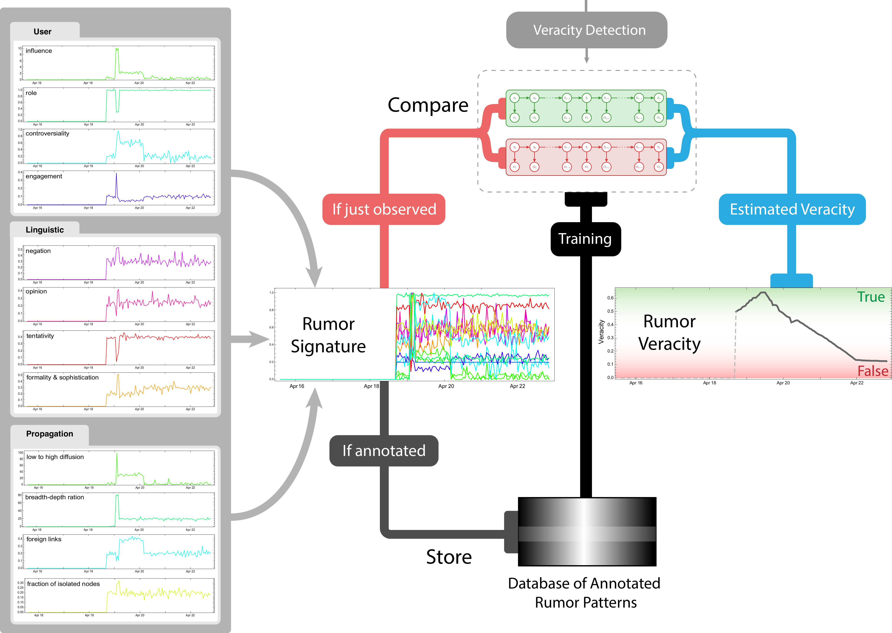

The spread of malicious or accidental misinformation in social media, especially in time-sensitive situations such as real-world emergencies, can have harmful effects on individuals and society. Motivated by this, we are creating computational models of false and true information on Twitter to investigate the nature of rumors surrounding real-world events. These models take into account the content, characteristics of the people involved, and virality of information to predict veracity. The models have been trained and evaluated on several real-world events, such as the 2013 Boston Marathon bombings, the 2014 Ferguson riots, and the Ebola epidemic, with promising results. We believe our system will have immediate real-world applications for consumers of news, journalists, and emergency services, and that it can help minimize and dampen the impact of misinformation.

